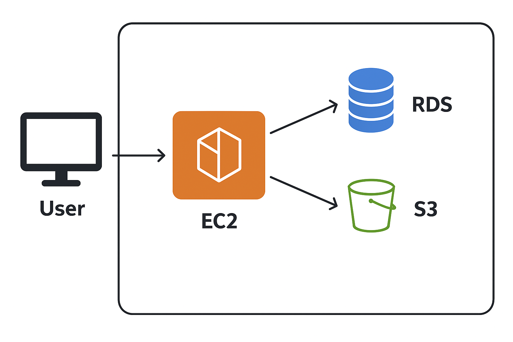

# Groupware System

> Spring Boot 기반 기업용 협업 그룹웨어 시스템  
> 전자결재 · 연차/근태 관리 · 자료실 · 공지사항 · 메신저(실시간 채팅) · 내정보 관리  
> **보안(Spring Security + Google OTP)**, **실시간(WebSocket)**, **외부 API 연동(Google Calendar)**, **브라우저 알림**까지 포함한 포트폴리오
> 프로젝트입니다.

---

## ※ 목차

1. [프로젝트 개요](#-프로젝트-개요)
2. [주요 기능](#-주요-기능)
3. [기술 스택](#-기술-스택)
4. [아키텍처](#-아키텍처)
5. [ERD](#-erd)
6. [화면 예시](#-화면-예시)
7. [개발 일정](#-개발-일정)
8. [포인트](#-포인트)

---

## ※ 프로젝트 개요

- **프로젝트명**: Groupware System
- **목적**: 기업 내 협업과 소통을 지원하는 그룹웨어 핵심 기능을 구현
- **기간**: 2025.09 ~ 2025.12 (약 4개월)
- **역할**: 개인 프로젝트 (기획, 개발, 배포 전 과정 담당)

---

## ※ 주요 기능

### 1. 업무관리

- 업무 등록/수정/삭제
- 업무 현황 조회

### 2. 전자결재

- 기안 작성 및 제출
- 내 결재 문서함 (기안/승인/반려/완료)
- 문서 양식 관리 (관리자)
- 결재 통계 및 로그 관리 (관리자)

### 3. 연차/근태 관리

- 연차 신청/취소/조회
- 근태 현황 관리
- **Google Calendar 연동** (자동 캘린더 반영)

### 4. 자료실

- 공유문서 업로드/다운로드
- 서식 자료실 관리

### 5. 공지사항

- 공지 등록/수정/삭제 (관리자)
- 공지 조회 (전체)

### 6. 메신저 (실시간 채팅)

- 1:1 및 그룹 채팅
- 읽음/안읽음 표시
- **WebSocket + Redis Pub/Sub** 기반 확장성 고려
- **브라우저 Notification API** 연동 (윈도우 알림)

### 7. 내정보

- 프로필 조회/수정
- 비밀번호 변경
- **Google OTP 기반 2단계 인증**

---

## ※ 기술 스택

### Backend

- Java 21, Spring Boot 3.x
- Spring Security (Role 기반 권한 관리, OTP 인증)
- JPA + MyBatis 혼합
- WebSocket, STOMP
- AOP (결재 로그 수집)

### Frontend / Integration

- javascript, jquery
- Chart.js (통계/로그 시각화)
- Notification API (브라우저 푸시 알림)

### Database

- Postgresql (주 데이터 저장)
- Redis (채팅 로그, 세션 캐싱)

### Integration

- Google Calendar API (연차 일정)
- Google OTP (2FA 인증)

### Infra & DevOps

- AWS EC2 (서버), RDS (DB), S3 (파일 업로드)   
  
- Docker, Docker Compose
- GitHub Actions (CI/CD)

---

## ※ 아키텍처

```text
[Frontend] React
│ REST API / WebSocket
[Backend] Spring Boot
├─ Controller (기능별 분리)
├─ Service (비즈니스 로직)
├─ Repository (JPA/MyBatis)
└─ Security (Spring Security + OTP)
│
[DB] Postgresql (데이터 저장)
Redis (세션/채팅 캐싱)
│
[Integration]
Google Calendar API
Google OTP
```

---

## ※ ERD

- **User**: 사용자 정보 (sid, login_id, password, name, email, birth, phone, position, group_sid, role, auth_level, created_at, updated_at, password_expired_at)
- **Task**: 업무 관리 (id, title, description, status, assignee_id 등)
- **Approval**: 전자결재 문서 (id, title, status, writer_id, approver_id 등)
- **AnnualLeave**: 연차 신청 (id, user_id, start_date, end_date, status)
- **Attendance**: 근태 기록 (id, user_id, date, type, status)
- **Document**: 자료실 문서 (id, title, type, file_url, uploader_id)
- **Notice**: 공지사항 (id, title, content, writer_id, created_at)
- **ChatRoom**: 채팅방 (id, name, type)
- **ChatMessage**: 채팅 메시지 (id, room_id, sender_id, content, created_at)

---

## ※ 화면 예시

> 추후 스크린샷 / GIF 추가 (예: 로그인 화면, 전자결재, 메신저 알림 등)

---

## 🌟 포인트

- 단순 CRUD가 아닌 **실제 기업에서 사용하는 그룹웨어 기능 구현**
- **보안**: Spring Security + Google OTP 기반 2FA
- **협업 강화**: WebSocket 실시간 채팅 + Windows 알림
- **외부 API 연동**: Google Calendar와의 통합
- **운영 경험**: Docker, AWS, CI/CD 적용
- **품질 관리**: JUnit 테스트, AOP 기반 로깅

---
